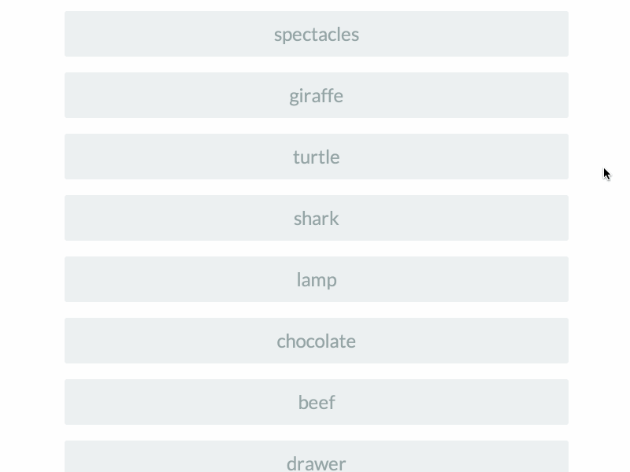

Swipe-li
==============



A three pane swipeable element. Swipe right for accept. Swipe left for reject. (AngularJS directive)

[Live Demo](http://winkerVSbecks.github.io/swipe-li)

The code is largely based on the hammer.js carousel demo.

Developed at [rangle.io](http://rangle.io)


## Dependencies

- jQuery
- AngularJS
- Angular-touch
- Hammerjs
- Modernizr

## Usage

`bower install swipe-li --save`

Include the following files in your app:

```
bower_components/jquery/dist/jquery.js
bower_components/modernizr/modernizr.js
bower_components/angular/angular.js
bower_components/hammerjs/hammer.js
bower_components/angular-touch/angular-touch.js
bower_components/dist/swipe-li.css
bower_components/dist/swipe-li.min.js
```

You then need to declare a dependency on the `swipeLi` module:
`angular.module('myApp', ['swipeLi']);`

## The Directive

```
<div
  swipe-li
  class="item"
  disabled=""
  intent="true"
  accept="done(item)"
  reject="skip(item)"
  main-content="'sample-content.html'"
  accept-content="'accept-content.html'"
  reject-content="'reject-content.html'"
  reset-to-content="false"
></div>
```

- `disabled`: disable the swipe-li element.
- `intent`: user Intent Detection. If the user drags the pane > 50% of the width the swipe will auto complete.
- `accept`: accept callback.
- `reject`: reject callback.
- `main-content`: template for the start pane.
- `accept-content`: template for the accept pane.
- `reject-content`: template for the reject pane.
- `reset-to-content`: should the swiped pane reset back to start pane on complete


## Development

1. Install dependencies `$ npm install`

2. `$ gulp dev` starts a simple node server and watches for changes

3. Go to http://localhost:3000/ to see the example app
